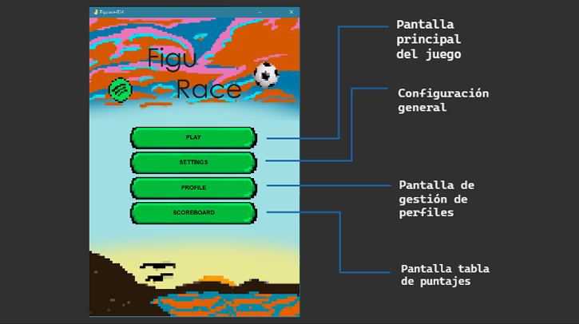
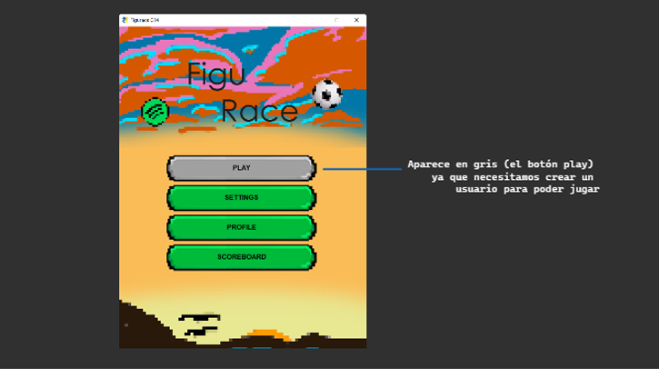
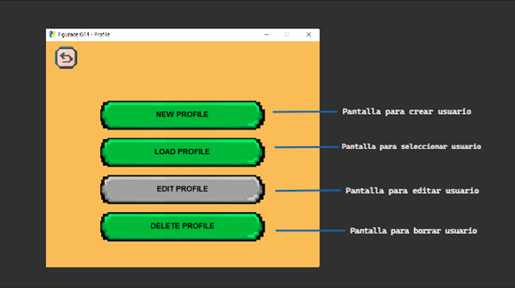
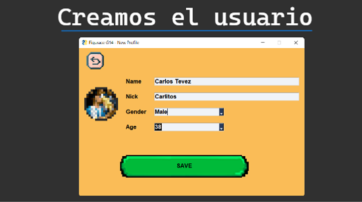
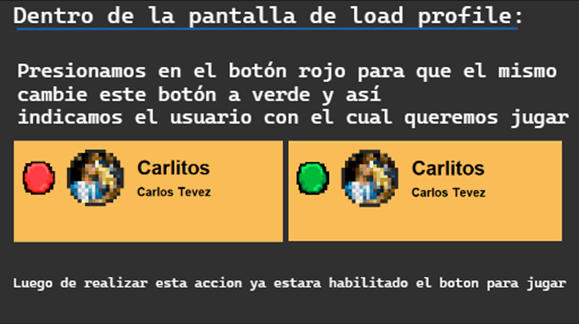
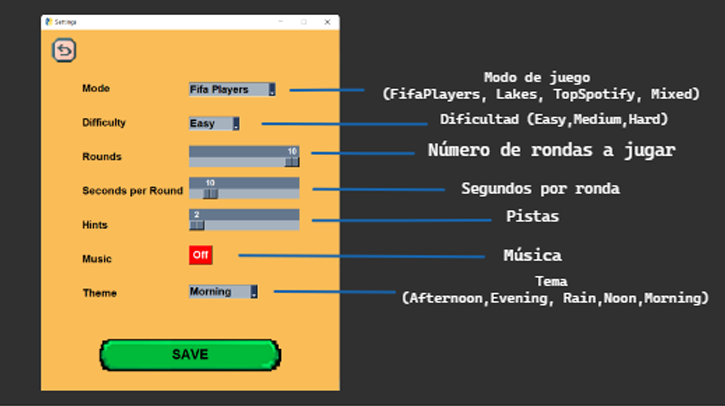
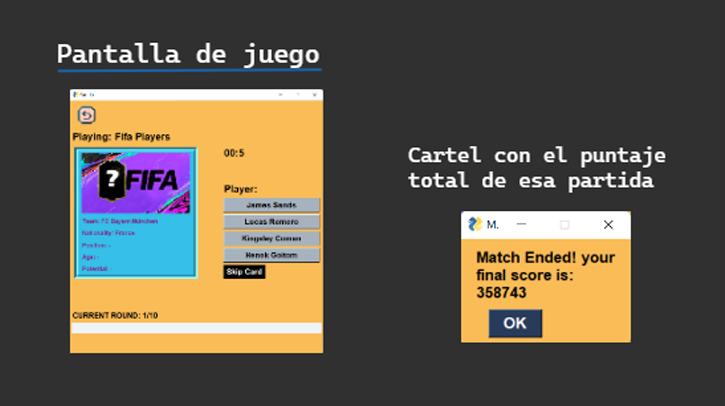
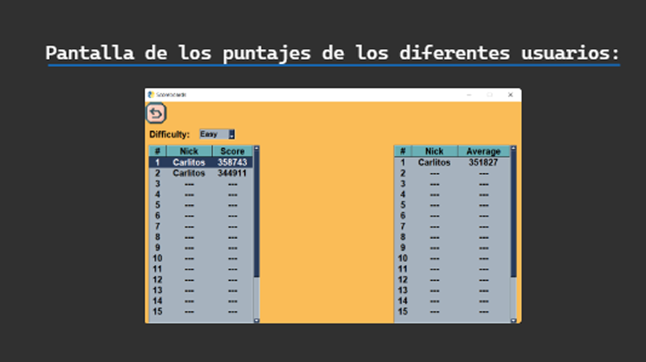
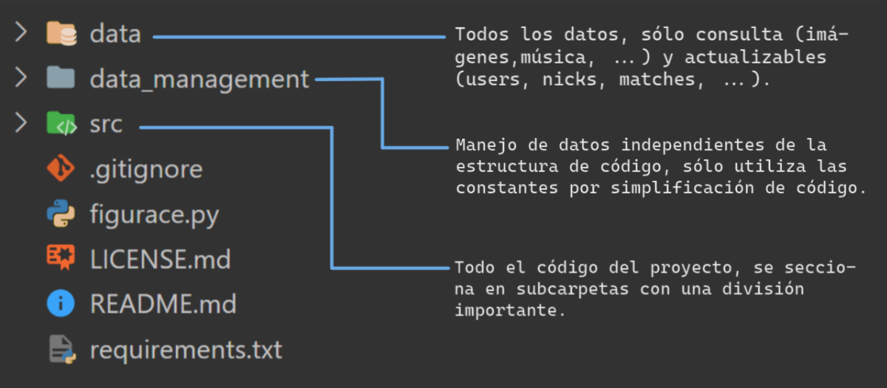
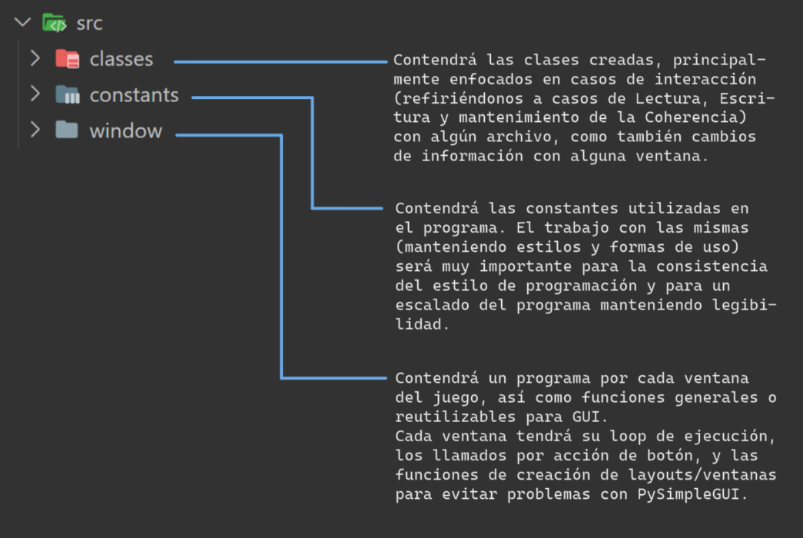

 <h1>FiguRace</h1> 

# About
Esta versión de FiguRace fue creada por Nicolás Bonoris, Ulises Geymonat, Ignacio Mariano y Enzo Francisco Battista; como proyecto para la materia "Seminario de Lenguajes - Python", Facultad de Informática, Universidad Nacional de La Plata.

 

# Créditos
Todo lo utilizado en este proyecto es de uso libre, o creado por los autores.
## Contenido
- Los **datasets** \(Spotify Top, FIFA Players y Lagos Argentinos\) se obtienen de:

    - [Spotify 2010 a 2019](https://www.kaggle.com/datasets/muhmores/spotify-top-100-songs-of-20152019 "kaggler.com")
    - [FIFA 2021 Complete Player Dataset](https://www.kaggle.com/datasets/aayushmishra1512/fifa-2021-complete-player-data?resource=download "kaggler.com")
    - [Lagos Argentinos](https://www.fesliyanstudios.com/es/royalty-free-music/downloads-c/8-bit-music/6 "ign.gob.ar")

- La **musica** se obtiene de [Fesliyan Studios](https://www.fesliyanstudios.com/es/royalty-free-music/downloads-c/8-bit-music/6 "Retro Forest - By David Fesliyan")
- Las **imágenes** son todas propias - o imágenes libres con modificaciones suficientes para considerarlas propias.
## Librerías
Para la realización del proyecto, se utilizaron múltiples librerías para conseguir un mejor producto, y para facilitar el desarrollo del mismo.
- Como librería principal para manejar la interfaz del videojuego, se utilizó [PySimpleGUI](https://www.pysimplegui.org "pysimplegui.org"), la cual permite la creación de las diferentes ventanas donde se ejecuta el juego.
- Para trabajar con los diferentes conjuntos de datos, se escogió la librería [Pandas](https://pandas.pydata.org/ "pandas.pydata.org"), la cual simplifica el manejo de datasets,y permitió, no solamente generar todas las estadisticas y graficos que genera el juego a partir de las partidas jugadas, sino que también se utilizó para realizar el funcionamiento principal del juego (elegir las opciones del conjunto de datos, y elegir la respuesta correcta).
- Para la realización de una ambientación musical, se utilizó la librería [PyGame](https://www.pygame.org/docs/ "pygame.org"), especialmente la funcionalidad del mixer, se verá su uso únicamente en la clase Settings.

 

# Guía de Instalación
Simplemente descargando/clonando este repositorio e instalando los requerimientos con "pip install -r requirements.txt" (en Windows) o "pip3 install -r requirements.txt" (en Linux) podrás jugar! Es necesaria una versión de Python a partir de 3.10, y tener instalado Tkinter (para Windows ya vendrá con Python, para Ubuntu por ejemplo el comando será "sudo apt-get install python3-tk").

 

# Guía de Usuario
La dinámica del juego se puede comprender de forma bastante simple, las funcionalidades principales serán:

 

## 1. Menú Principal

 

## 2. Administración de usuarios

(también podremos eliminar y modificar un perfil de forma muy similar a las dos funciones reién vistas)

 

## Configuración

## Partida/Juego

 

## Pantalla de puntajes

 

Para conseguir un mejor puntaje será muy importante que tengas en cuenta la dificultad/tiempo disponible/nivel de dificultad del juego, lo cual podrás configurar en _Settings_; FiguRace premia el coraje del jugador, a mayor reto tendrás una mayor recompensa!

 

(Pssst... Te recomiendo contestar lo más rápido que puedas, ya que tu tiempo restante se verá reflejado en tu puntuación)

 

# Guía para Desarrolladores
Comenzando por la estructura de directorios, tendremos una estructura como se muestra en la imagen:

Todos los archivos de Lectura/Escritura se ubicarán en “data”, para el acceso a un archivo se recomienda añadir su dirección como una constante en “src > constants > directions”, se recomienda seguir con el orden por subdirectorios, para facilitar la ubicación de cada archivo (una buena práctica sería por ejemplo separar las imágenes por uso, como se vino haciendo hasta el release v3.0 - o “tercer entrega”, como prefieren decirle algunos).
Para el agregado de programas que no sean utilizados en la ejecución del juego y que utilicen los datos (ya sea en forma de lectura o escritura), se hará dentro del directorio “data_management”.
El código del programa se alojará en “src”, la estructura dentro del mismo está también definida, para un mayor orden:

El funcionamiento se basará en 3 sectores principales: **datos**, **clases** y **ventanas**. La interacción entre estos 3 irá definiendo toda la estructura; clases y ventanas consultarán constantemente las constantes del proyecto y el contenido de lectura de “data”.

La _interacción con los archivos volátiles_ (“matches” con los datos de partidas, “users” con los datos de los usuarios, “loaded_nicks” con todos los nicks en uso y correspondencia de acceso con usuarios en “users”, y “cached_settings”) será principalmente (si no de forma exclusiva) por medio de las **clases**, que _a su vez interactuarán con cada ventana_, y estas con el usuario.
 
Las **ventanas** _interactuarán con el usuario y las clases_. Se busca que cada ventana esté contenida en un programa dedicado, el cual tendrá la función creadora del layout, la función creadora de la ventana y el loop de ejecución de la misma, además de cualquier función que se quiera, si es esta exclusiva de esta ventana. En la carpeta window podremos ubicar otras funciones si son exclusivamente para uso de GUI (un ejemplo es “card_creation.py”, con funcionalidades para la creación de botones y tarjetas en la ventana de juego).
 
Para el escalado eficiente del programa, cualquier agregado en estilos o direcciones deberá verse reflejado en **constants**, que contendrá todas las _constantes del programa_.

---

Explicar cada ventana se considera innecesario, conociendo la estructura que acaba de mencionarse y el recorrido mencionado en la guía de usuario debería ser más que suficiente. Con las clases, consideramos útil una explicación en profundidad, por lo que procederemos a explicar cada una:

### Match
La instancia de esta clase va a controlar una partida de una forma que consideramos de “bajo nivel”, desde interacción con los archivos hasta el guardado de los datos de la misma. Creará y guardará los eventos en una lista temporal que contendrá un conjunto de los mismos, para luego ante la finalización de la partida guardarlos (si esto es lo que se pide) en el archivo “matches.csv”. Obtiene de “Settings” los datos actuales de configuración, y escribirá en “matches.csv”.

### InGameEvents
Al crear una instancia (que recibirá una referencia para el objeto “Match” referente a la partida en curso, y otra para la ventana siendo usada actualmente), controlaremos la comunicación entre el objeto de la partida y la ventana. Contiene funciones específicas para cada evento producido desde la ventana (como tiempo acabado, respuesta acertada, partida abandonada, etc.), y para la modificación de la ventana en uso (para la actualización en botones y tarjetas de una forma mucho más legible y eficiente). Será un nexo entre la ventana de juego y la instancia de la partida actual.

### Settings
Será completamente estática, no instanciable (al igual que la clase “Player”, por temas de eficiencia y simplicidad, ya que así se cumple mejor con el fin y se descartan errores). Contendrá información sobre la configuración actual de la partida, obteniendo los datos de la ejecución más reciente de “cached_settings.json”, y actualizando el mismo al cerrarse la ventana de menú, preparando los datos para la próxima ejecución.

### Player
Será completamente estática y controlará los datos de los jugadores, ya sean eliminaciones, modificaciones, creaciones, o manejos de problemas de consistencia. Tendrá disponibles los datos modificables del jugador actual (no el nick ni los datos de partidas jugadas), y ante cualquier modificación los actualizará.

---

Como último tema importante a tratar, podemos hablar de las consideraciones hacia los posibles errores por modificación manual de los archivos, que fue una de las preocupaciones principales al momento de llevar a cabo las clases (que llevarán toda interacción con los datos). El fin principal en el que nos centramos fue en evitar la ruptura del programa y/o la muestra de información no válida, por lo que ante cualquier inconsistencia en los datos, error en la estructura del archivo, cargado de datos no válidos, fallo por archivo inexistente, etcétera; se creará un nuevo archivo en blanco y se pisará la dirección en la que este debería existir. Esto es una tarea muy compleja, por lo que seguirán habiendo errores en contadas ocasiones, la guía de uso en “README.txt” deberá advertir en contra de esta práctica, y ante cualquier error a causa de esto, recomendar una reinstalación del paquete completo.
El funcionamiento se basará en 3 sectores principales: datos, clases y ventanas. La interacción entre estos 3 irá definiendo toda la estructura; clases y ventanas consultarán constantemente las constantes del proyecto y el contenido de lectura de “data”. La escritura sobre los archivos volátiles (“matches” con los datos de partidas, “users” con los datos de los usuarios, “loaded_nicks” con todos los nicks en uso y correspondencia de acceso con usuarios en “users”, y “cached_settings”)

 

# Release v0.3
Entrega 3 previa a la exposición oral.
### Major Fixes & Main Changes
Se agrega esto y lo otro, se arregla such and such, esto es nomás una prueba de texto para ver como queda, quedaria mejor si hubiese puesto "Placeholder", pero eso no importa! Remember, _this is only a test_.
- Cambios en estructura de directorios.
    - Se separa MainClasses en dos clases separadas Player y Settings, ya no hay problemas de importación circular.
    - Se elimina "misc" para pasar a ser "constants", creación de cartas pasa a pertenecer a "window".
    - Analysis pasa a "data_management".
- Se arreglan algunos problemas estéticos, de colores, tamaños y fuentes.
- Comienzan a manejarse estilos consistentes, globales. Los datos para esto se encuentran en "constants > style.py".
- Bug fixes en torno al manejo de errores por manipulación manual de archivos.
- Se termina de ordenar 
- _Fresh new README_ (Hi there!).
### What's new
- Nueva función para cambio de temas, con diferentes climas para setear FiguRace, gracias a las facilidades aportadas por los nuevos estilos globales añadidos.
### What's next
- Los principales cambios para considerar en caso de querer mejorar el proyecto van a ir en torno a la estética principalmente (incluyendo en esta las funciones de accesibilidad), y tal vez añadir seguridad ante errores por manipulación manual de archivos.
- Los principales cambios para considerar en caso de querer mejorar el proyecto van a ir en torno a la estética principalmente, y tal vez añadir seguridad ante errores por manipulación manual de archivos.
- Siguientes principales:
    - Escalar el diseño de las pantallas para que tengan un tamaño responsivo, va a necesitarse utilizar una librería capaz de realizar un resizing de imágenes y un constantes globales de tamaños escalares, que serán unidades de una cantidad determinada por la resolución actual.
    - Buscar formas de arreglar el diseño de las tablas en scoreboards, y en caso de no existir dicha solución, cambiar el método.
    - 
- De todas formas, el futuro no apunta a que haya un nuevo release de este proyecto :( . Nada en el Universo parece ser perfecto, y ninguna creación humana alcanzó de momento el grado de perfección que la naturaleza nos postula - parece eso una buena excusa para justificar errores que no serán arreglados.

 

---

#### Hasta un próximo proyecto!

